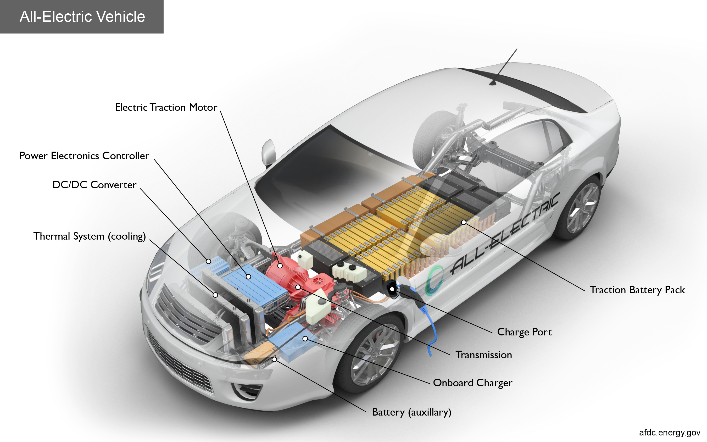
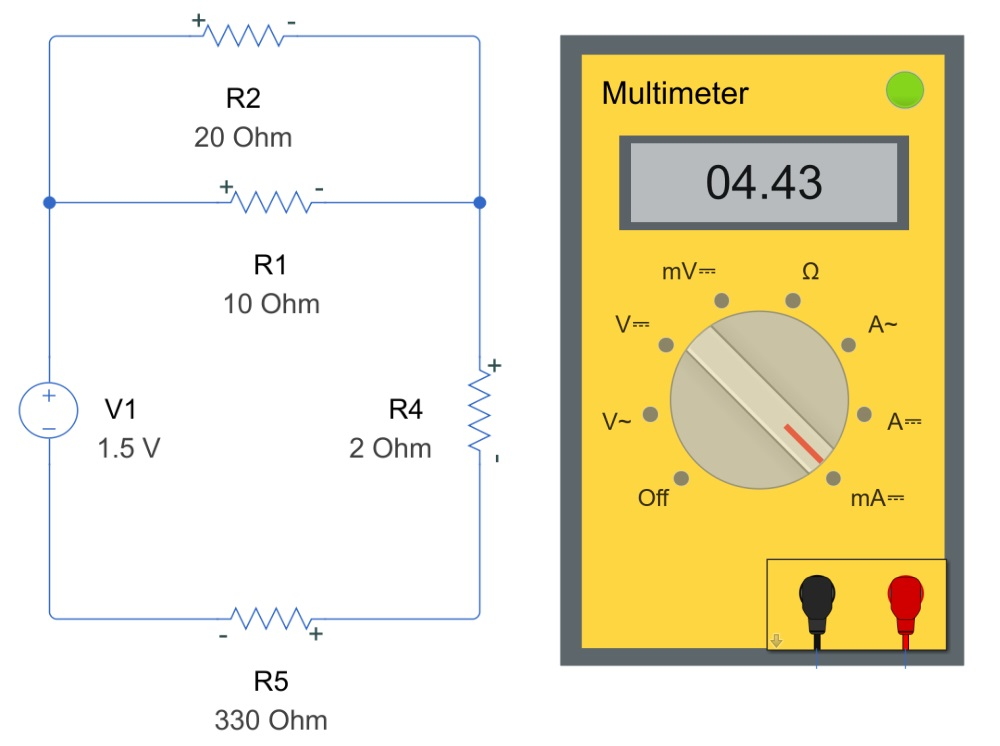

# Power Electronics

 or 

**Curriculum Module**

_Created with R2024a. Compatible with R2024a and later releases._

# Information

This curriculum module contains interactive [MATLAB® live scripts](https://www.mathworks.com/products/matlab/live-editor.html), [Simulink®](https://www.mathworks.com/products/simulink.html), and [Simscape™](https://www.mathworks.com/products/simscape.html) models that teach the fundamental components of power electronics.

## Background

You can use these live scripts as demonstrations in lectures, class activities, or interactive assignments outside class. In the first script, students learn about the process of rectification (AC\-DC) and various types of rectifiers, such as half\-wave and full\-wave and their applications. In subsequent scripts, students will learn about inverters (DC\-AC) and converters (DC\-DC). Throughout the module, students are exposed to thinking in systems beyond the individual component being discussed. In the final part of each script, there is an interactive real world application to help drive understanding of the "what" and "why" behind the particular component.

The instructions inside the live scripts will guide you through the exercises and activities. Get started with each live script by running it one section at a time. To stop running the script or a section midway (for example, when an animation is in progress), use the  Stop button in the **RUN** section of the **Live Editor** tab in the MATLAB Toolstrip.

## Contact Us

Solutions are available upon instructor request. Contact the [MathWorks teaching resources team](mailto:onlineteaching@mathworks.com) if you would like to request solutions, provide feedback, or if you have a question.

## Prerequisites

This module assumes knowledge of basic circuit theory. There is minimal MATLAB knowledge required for these scripts and models, but you could use [MATLAB Onramp](https://matlabacademy.mathworks.com/details/matlab-onramp/gettingstarted), [Simulink Onramp](https://matlabacademy.mathworks.com/details/simulink-onramp/simulink), and [Power Electronics Simulation Onramp](https://matlabacademy.mathworks.com/details/power-electronics-simulation-onramp/powerelectronics) as resources to acquire familiarity with MATLAB syntax, live scripts, and Simulink models .

## Getting Started
### Accessing the Module
### **On MATLAB Online:**

Use the  link to download the module. You will be prompted to log in or create a MathWorks account. The project will be loaded, and you will see an app with several navigation options to get you started.

### **On Desktop:**

Download or clone this repository. Open MATLAB, navigate to the folder containing these scripts and double\-click on [PowerElectronics.prj](https://github.com/MathWorks-Teaching-Resources/Power-Electronics/blob/release/PowerElectronics.prj). It will add the appropriate files to your MATLAB path and open an app that asks you where you would like to start. 

Ensure you have all the required products ([listed below](#H_E850B4FF)) installed. If you need to include a product, add it using the Add\-On Explorer. To install an add\-on, go to the **Home** tab and select   **Add-Ons** > **Get Add-Ons**. 

## Products

 *MATLAB* is used throughout. Tools from *Simulink*,  *Simscape™, Simscape Electrical™* are used frequently as well.

# Scripts

 *If you are viewing this in a version of MATLAB prior to R2023b, you can view the learning outcomes for each script* [*here*](https://www.mathworks.com/matlabcentral/fileexchange/173035-power-electronics)

## [**Rectifiers.mlx**](https://matlab.mathworks.com/open/github/v1?repo=MathWorks-Teaching-Resources/Power-Electronics&project=PowerElectronics.prj&file=Rectifiers.mlx)
|  | **In this script, students will...**    | **Academic disciplines**     |
| :-- | :-- | :-- |
|     | • Learn about the types of rectifiers (AC\-DC)   • Review the theory of rectifier functionality   • Simulate behavior of different rectifier models   • Apply rectifier theory to charging a mobile phone    | • Electrical Engineering     |

## [**Converters.mlx**](https://matlab.mathworks.com/open/github/v1?repo=MathWorks-Teaching-Resources/Power-Electronics&project=PowerElectronics.prj&file=Converters.mlx)
|  | **In this script, students will...**    | **Academic disciplines**     |
| :-- | :-- | :-- |
|     | • Learn about the types of DC\-DC converters   • Review the theory of DC\-DC converter functionality   • Simulate behavior of different converter models   • Apply converter theory to distributing power in an electric vehicle    | • Electrical Engineering     |

## [**Inverters.mlx**](https://matlab.mathworks.com/open/github/v1?repo=MathWorks-Teaching-Resources/Power-Electronics&project=PowerElectronics.prj&file=Inverters.mlx)
|  | **In this script, students will...**    | **Academic disciplines**     |
| :-- | :-- | :-- |
|     | • Learn about the types of inverters (DC\-AC)   • Review the theory of inverter functionality   • Simulate behavior of different inverter models   • Apply inverter theory to converting electricity from solar panels    | • Electrical Engineering     |

# License

The license for this module is available in the [LICENSE.md](https://github.com/MathWorks-Teaching-Resources/Power-Electronics/blob/release/LICENSE.md).

# Related Courseware Modules

## [DC Circuit Analysis](https://www.mathworks.com/matlabcentral/fileexchange/103375-dc-circuit-analysis?s_tid=srchtitle)
|     | **Available on:**           [GitHub](https://github.com/MathWorks-Teaching-Resources/DC-Circuit-Analysis)      |
| :-- | :-- |

## [Battery Systems: introduction](https://www.mathworks.com/matlabcentral/fileexchange/172770-battery-systems-introduction?s_tid=srchtitle)
|     | **Available on:**           [GitHub](https://github.com/MathWorks-Teaching-Resources/Battery-Systems)      |
| :-- | :-- |

Feel free to explore our other [modular courseware content](https://www.mathworks.com/matlabcentral/fileexchange/?q=tag%3A%22courseware+module%22&sort=downloads_desc_30d).

# Educator Resources
-  [Educator Page](https://www.mathworks.com/academia/educators.html)

# Contribute 

Looking for more? Find an issue? Have a suggestion? Please contact the [MathWorks teaching resources team](mailto:%20onlineteaching@mathworks.com). If you want to contribute directly to this project, you can find information about how to do so in the [CONTRIBUTING.md](https://github.com/MathWorks-Teaching-Resources/Power-Electronics/blob/release/CONTRIBUTING.md) page on GitHub.

 *©* Copyright 2024 The MathWorks™, Inc

